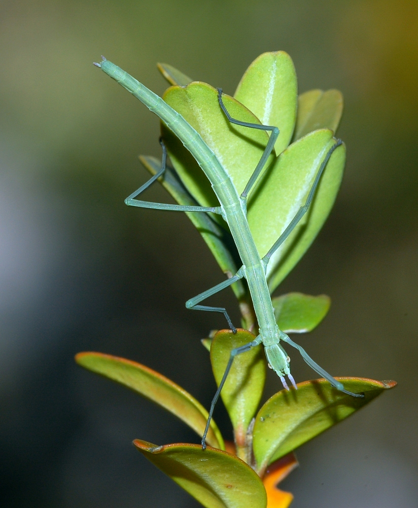
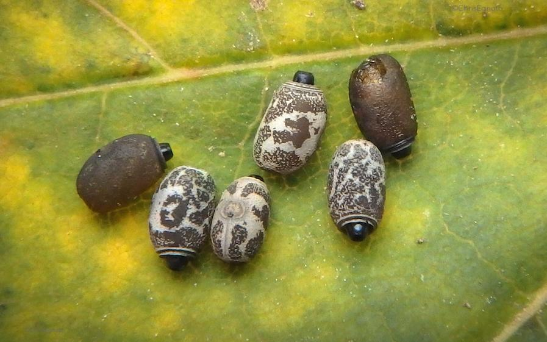
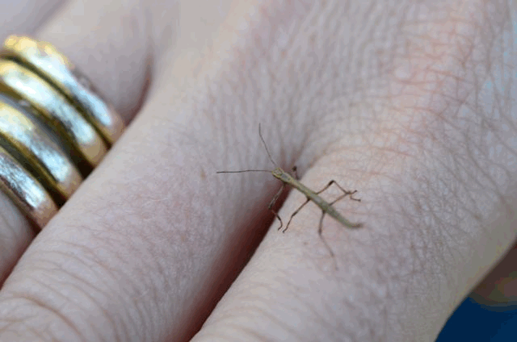
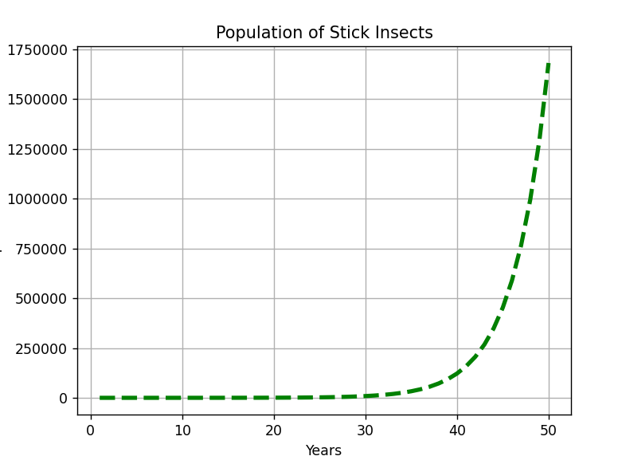

# How to grow stick insects!

## What are *stick insects*
Stick insects are a family of insects, that try to appear like leaves or twigs.
They tend to eat plants, and move very slowly. They might slowly same speed as leaves around
wiggle their body from one side to another. Their colors are usually greenish or brownish.

Below you can see an example stick insect. <br>



### What kind of food stick insects need
Most stick insects can eat next plant leaves:
    1. Salal (very thick dark green leaves)
    2. Salad
    3. Lemon Balm
    4. Rasberry leaves
    5. Rose
   
Some species are adapted to eat only a few exotic type of leaves.
For example Peruphasma schultei eats only:
 * Aucuba japonica 
 * honeusucke 
 * privet.
  


### What kind of enclosure stick insects need

It is ***very*** important to offer large enough terrarium for the stick insects.
Personally, i would never recommend smaller than ***60cm x 45cm x 45cm***
where 60cm is *the height*.

The bottom material should be easy to change, for example paper. 
Stick insects drink water from droplers sprayed on the wall of terrarium.

### Stick Insect Babies

It is possible to raise a next generation of stick insects.
As adults, many species tend to lay eggs. 
Some species are all females, others need both male and female to make eggs.
The eggs are usually small, brownish, a bit mosaic color, found on the bottom.
If you want, you can collect these eggs, keep them on moist small box, and wait for about 6 months.
Then there will hatch tiny new stick insects.





### Population of stick insects in nature

The population of stick insects in nature depends largery on next factors:
<table>
<tr>
<th>Human threats</th>
<th>Predators</th>
<th>Diseases</th>
</tr>
<tr>
<td>Forest cutting</td>
<td>Birds</td>
<td>Parasite wasps</td>
</tr>
</tr>
<tr>
<td>Agriculture</td>
<td>Wasps</td>
<td>Nematomorpha</td>
</tr>
</tr>
<tr>
<td>Poisons released in nature</td>
<td>Lizards</td>
<td>Viruses</td>
</tr>
</tr>
<tr>
<td>Climate Change</td>
<td>Mammals</td>
<td>Bacteria</td>
</tr>
</table>


### What would happen if ur stick insects escape?:

Depending on country, the climate might be too cold. 
For example, in Finland, stick insects wont survive through the winter even as eggs.
While for example for many Mediterranean countries, they might cause problem.
They could even become a new species for the area. 

I will make for demo purposes a simple matplotlib graph to describe,
What could happen if 5 (parthenogenetic) stick insects escape:



Graafi on saatu aikaiseksi seuraavalla koodilla (oikeasti vähän demoluonteinen, ei perustu esim. tilastolliseen estimointiin tai Logistiseen Populaatiomalliin):

```
# Use a custom model to estimate stick insect population
# assuming they escape enclosure and survive the climate

import matplotlib.pyplot as plt
import numpy as np

# variables u can modify
starting_population = 5
years_to_predict = 50

# final datas
years = np.arange(1, years_to_predict + 1)
population = np.arange(1, years_to_predict + 1)


# returns population at the end of year
def pop_growth_yearly(population_start):
    return population_start * 1.3 + np.random.uniform(-0.5, 0.5)


for i in range(len(population)):
    population[i] = pop_growth_yearly(starting_population)
    starting_population = population[i]

print(years)
print(population)

plt.plot(years, population, "g--", linewidth=3)
plt.grid(True)
plt.title("Population of Stick Insects")
plt.xlabel("Years")
plt.ylabel("Population")
plt.ticklabel_format(style="plain")
# plt.axis((0, 100000, 0, 2000000))
plt.show()
```

> If you want to learn how to model more professionally populations, please refer to next link:
> https://michaelneuper.com/posts/modelling-population-growth-in-python/


# 